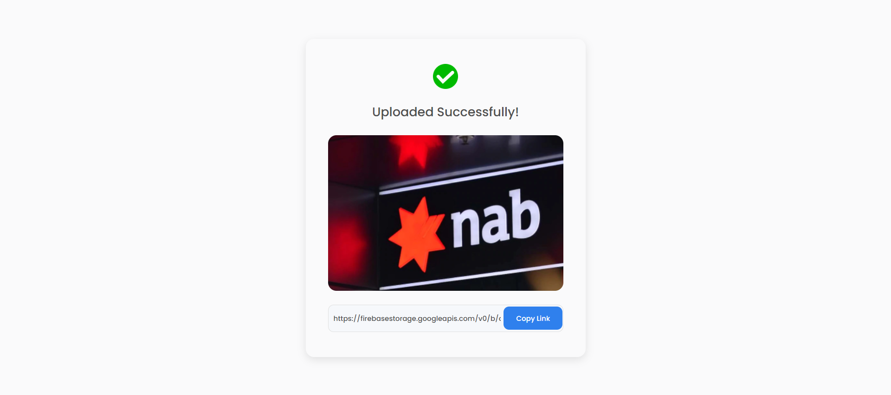

# Image Uploader

<div align="center">
   Solution for a challenge from  <a href="http://devchallenges.io" target="_blank">Devchallenges.io</a>.
</div>

## Overview



[Live version](https://image-uploader-khoinpb96.vercel.app/)

### Built With

- [React](https://reactjs.org/)
- [styled-components](https://www.styled-components.com/)
- [Firebase](https://firebase.google.com/)

## Features

This application/site was created as a submission to a [DevChallenges](https://devchallenges.io/challenges) challenge. The [challenge](https://devchallenges.io/challenges/O2iGT9yBd6xZBrOcVirx) was to build an application to complete the given user stories:

- I can drag and drop an image to upload it
- I can choose to select an image from my folder
- I can see a loader when uploading
- When the image is uploaded, I can see the image and copy it
- I can choose to copy to the clipboard

## How To Use

To clone and run this application, you'll need [Git](https://git-scm.com) and [Node.js](https://nodejs.org/en/download/) (which comes with [npm](http://npmjs.com)) installed on your computer. From your command line:

```bash
# Clone this repository
$ git clone https://github.com/khoinpb96/image-uploader.git

# Install dependencies
$ yarn

# Create the .env file and set below variables
$ REACT_APP_APIKEY
$ REACT_APP_APP_ID

# Run the app
$ yarn start
```

## Contact

- [GitHub](https://github.com/khoinpb96)
- [LinkedIn](https://www.linkedin.com/in/bao-khoi/)
